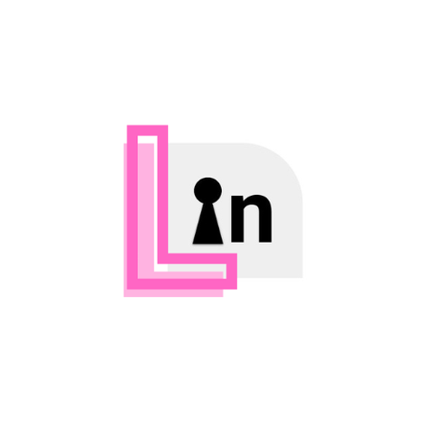

# Locked In

</img>

Challenge your friends with a friendly competition to see who is **locked in**, and who is **locked out**.

Sync up your phones for a study session,
maintain your focus score by staying locked in, and in the end see who could stay focused the most.

## Tech Stack
The frontend is written in Dart using Flutter and the backend is written in Python using FastAPI. The connection between devices is done by connecting through the backend.
